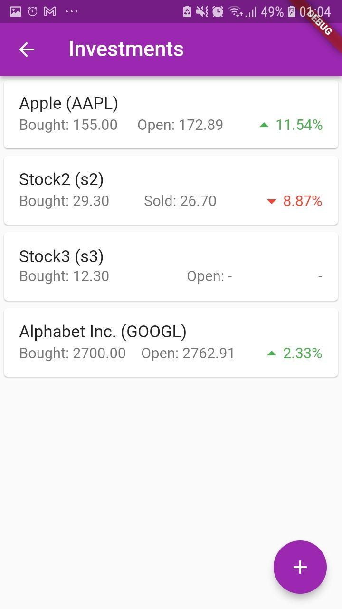
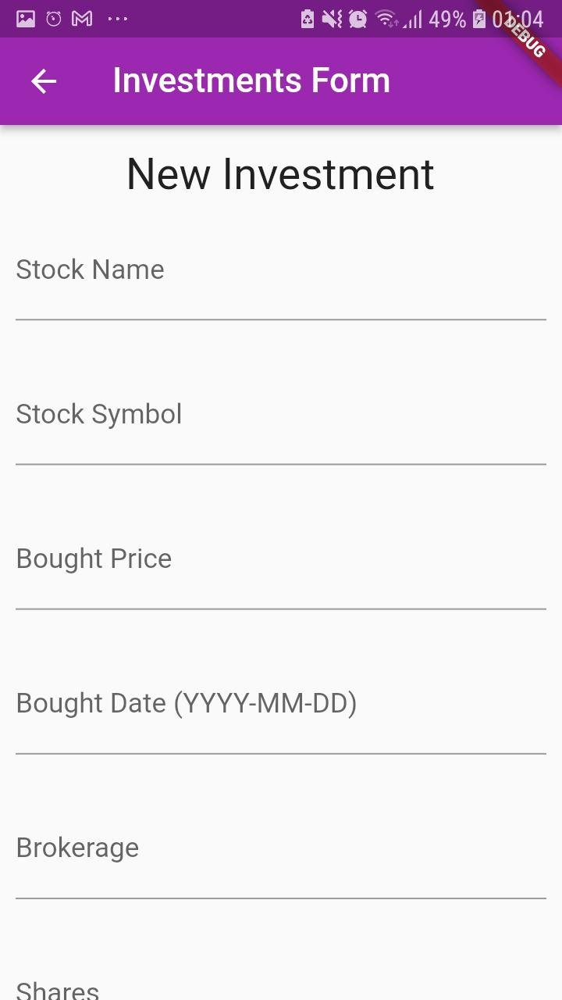
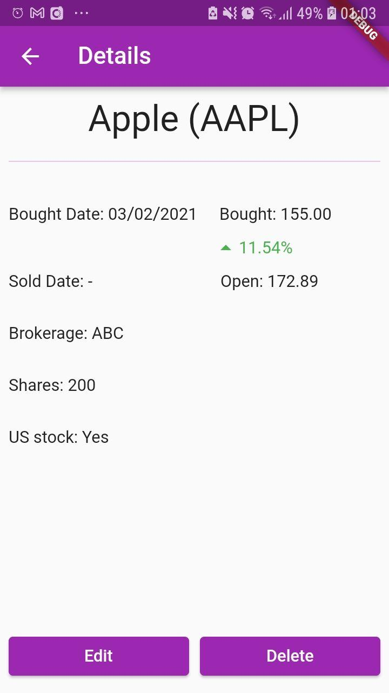

# MyFin

MyFin is a mobile app for those looking for a consolidated view of all their financials in 1 lightweight app. This current iteration only contains functionality with respect to investments, but more features about savings, debt, loans, properties are to come in future iterations.

This app was built using Flutter, Sqflite(database storage), and AlphaVantage API(for US stock opening prices).

## Screenshots of the app
 
 

## Download
This is still a work in progress with more work to be done with respect to the UI and the other features.
To download the current version, please clone the github, connect your mobile device and enter `flutter run` in the directory of the cloned repo. 
